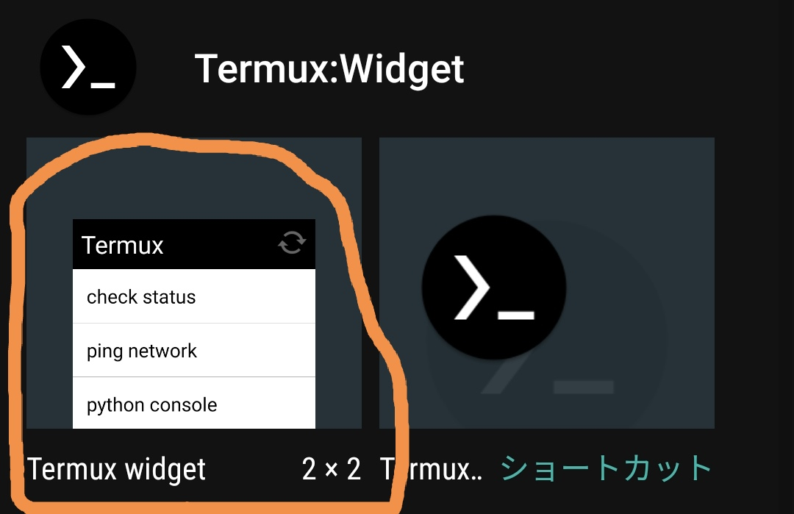

# 5ch用の大きな数字のアンカー生成器

## 概要

5ch用の大きな数字のアンカー生成器です  
Androidで動作確認  
bashとpython3が動く環境があれば動きます  

## Androidでのインストールの仕方

1. TermuxとTermux:APIとTermux:Widgetをf-droidから全部ダウンロードします
<https://f-droid.org/en/packages/com.termux/>  
<https://f-droid.org/en/packages/com.termux.api/>  
<https://f-droid.org/ja/packages/com.termux.widget/>  

1. 次のコマンドをコピーし、Termuxに貼り付けレポジトリをインストールします

   ```bash
   apt update && apt upgrade -y && apt install git termux-exec termux-api termux-tools -y &&  apt autoclean -y && git clone https://github.com/duchess-seducing-pureness3/5ch_huge_anchor_tfoyigiuhuoo.git && chmod +x $HOME/5ch_huge_anchor_tfoyigiuhuoo/install.sh && bash $HOME/5ch_huge_anchor_tfoyigiuhuoo/install.sh
   ```

1. 次のコマンドをtermuxに貼り付けEnterを押し、その後□ボタンからtermuxをタスクキルして終了します。

   ```bash
   exit
   ```

1. ホーム画面に戻りTermux:Wdgetのウィジェットを設置します  
   画像のようなのを探し出し好きなところに置いて下さい  

1. インストールおわり

## 使い方

1. インストール時に設置したウィジェットにある「tasks/大きな数字のアンカーを生成」をタップ
2. 通知欄にアンカーが出るのでタップしてコピー
3. chmateに貼り付けておわり

## アンインストールのしかた

1. アプリごとアンインストールすれば全部消えます
2. アプリをアインインストールしたくなければ必要に応じてパッケージを削除して下さい  
   インストール時に新たに導入したパッケージはgit termux-exec termux-api termux-tools python jq の6つです

   ```bash
   apt remove -y git termux-exec termux-api termux-tools python jq && apt autoremove -y && apt autoclean -y
   rm -rf $HOME/5ch_huge_anchor_tfoyigiuhuoo
   ```

